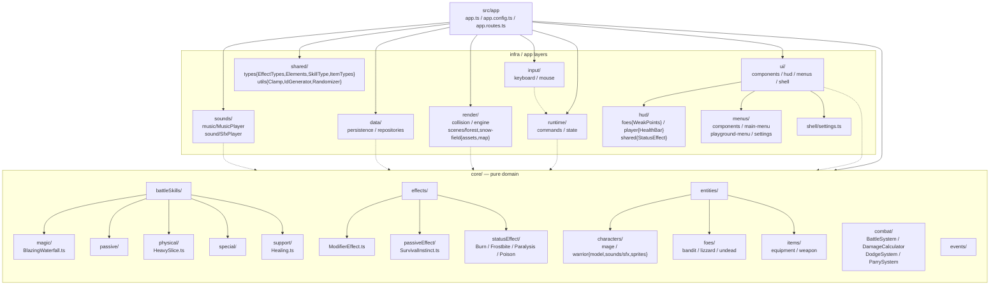

# AGENTS.md

## Stack & toolchain

- Angular 22, standalone components only (no NgModules). Bootstrap via `bootstrapApplication` in `src/main.ts`.
- Package manager is **pnpm** (pinned `pnpm@11.22.0`). Use `pnpm`, never `npm`/`bun`.
- TypeScript 6.0 with `ignoreDeprecations: "6.0"`. Strict-ish flags in `tsconfig.json`:
  - `noImplicitOverride` → override inherited members with `override`.
  - `noPropertyAccessFromIndexSignature` → bracket access for index signatures.
  - `experimentalDecorators` is on; Angular still uses decorators.
- Styling: **Tailwind v4** via `@tailwindcss/postcss` (see `.postcssrc.json`), global entry `src/styles.css`. No `tailwind.config.js`.
- Prettier: `printWidth: 100`, `singleQuote: true`. HTML uses the `angular` parser.
- Audio via `howler` (`src/app/sounds`).

## Commands

- `pnpm start` / `ng serve` → dev server at http://localhost:4200 (serve defaults to `development`).
- `pnpm build` / `ng build` → **defaults to `production`**, which enforces budgets: initial bundle `1MB` error, **anyComponentStyle `8kB` error** (keep component styles small or you'll fail the prod build).
- `pnpm test` / `ng test` → **Vitest** under the hood (`@angular/build:unit-test`), not Karma/Jasmine. No spec files exist yet.
- No `lint` script is configured; formatting is Prettier only (`pnpm exec prettier`).

## Import conventions

- Internal imports use the `@app/*` alias → `src/app/*` (defined in `tsconfig.json`). Use it instead of relative `../..` paths.
- Component selector prefix is `app` (per `angular.json`).

## Architecture (src/app)

Layered, framework-agnostic where possible. `core/` is pure TS (no Angular/DI).



> `ui/` is scaffolded with empty stubs.

<details>
<summary>tree /A (folders)</summary>

```
src\app\{core\{battleSkills\{magic,passive,physical,special,support},combat,effects\{passiveEffect\effects,statusEffect\effects},entities\{characters\{mage,warrior\{model,sounds\sfx,sprites}},foes\{bandit,lizzard,undead},items\{equipment,weapon}},events},data\{persistence,repositories},input\{keyboard,mouse},render\{collision,engine,scenes\{forest,snow-field\{assets,map}}},runtime\{commands,state},shared\{types,utils},sounds\{music,sound},ui\{components,hud\{foes\{components,view},player\{components,view},shared\components},menus\{components,main-menu,playground-menu,settings},shell}}
```

</details>

<details>
<summary>tree /A /F (with files)</summary>

```
src\app\{app.config.ts,app.html,app.routes.ts,app.ts,core\{index.ts,battleSkills\{index.ts,SkillModel.ts,magic\{BlazingWaterfall.ts,index.ts},passive,physical\{HeavySlice.ts,index.ts},special,support\{Healing.ts,index.ts}},combat\{BattleSystem.ts,DamageCalculator.ts,DodgeSystem.ts,index.ts,ParrySystem.ts},effects\{Effect.ts,ModifierEffect.ts,passiveEffect\{PassiveEffect.ts,effects\{SurvivalInstinct.ts}},statusEffect\{StatusEffect.ts,effects\{Burn.ts,Frostbite.ts,Paralysis.ts,Poison.ts}}},entities\{GameEntity.ts,index.ts,LevelUpSystem.ts,characters\{CharacterEntity.ts,index.ts,mage,warrior\{model,sounds\sfx,sprites}},foes\{FoeEntity.ts,index.ts,bandit,lizzard,undead},items\{index.ts,ItemModel.ts,equipment,weapon}},events},data\{persistence,repositories},input\{keyboard,mouse},render\{collision,engine,scenes\{forest,snow-field\{assets,map}}},runtime\{commands,state},shared\{index.ts,types\{EffectTypes.ts,Elements.ts,index.ts,ItemTypes.ts,SkillType.ts},utils\{Clamp.ts,IdGenerator.ts,index.ts,Randomizer.ts}},sounds\{music\{MusicPlayer.ts},sound\{SfxPlayer.ts}},ui\{components,hud\{foes\{components\{WeakPoints.ts},view\{StatusEffectView.ts}},player\{components\{HealthBar.ts},view\{character.ts,inventory.ts,team.ts}},shared\components\{StatusEffect.ts}},menus\{components,main-menu,playground-menu,settings},shell\{settings.ts}}}
```

</details>

## Commits

Conventional atomic commits, no description and short title group by semantic changes. Then do push

**Checklist (before every commit):**
1. `git diff --staged` — review what's staged
2. Split by semantic concern: each commit = one logical change (rename, delete, feature, fix)
3. Use conventional prefix: `feat:`, `fix:`, `refactor:`, `chore:`, etc.
4. Update package.json: "version": "X.X.X" number based on conventional commits of step 3.
5. Push after all atomic commits are done